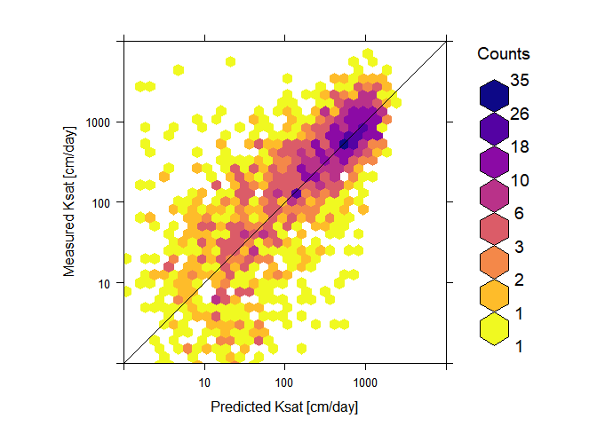
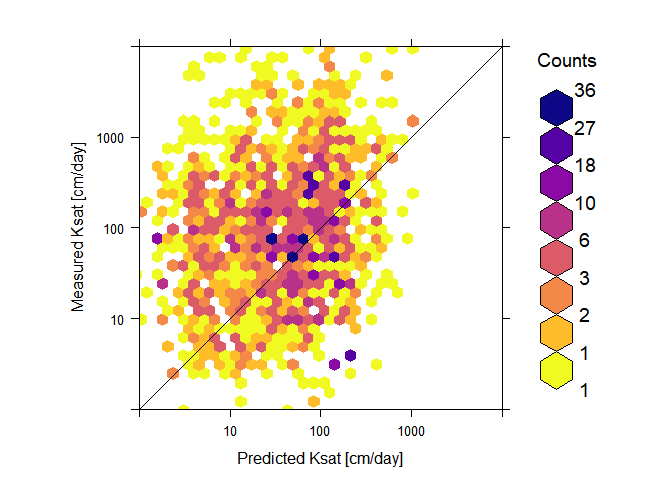

Pedotransfer functions (PTFs) developed for Ksat using Random forest
(RF) algorithm
================
Surya Gupta, Tom Hengl, Peter Lehmann, Sara Bonetti, Dani Or

  - [Installing and loading packages](#installing-and-loading-packages)
  - [Temperate climate region Ksat values
    PTF](#temperate-climate-region-ksat-values-ptf)
  - [Temperate Ksat PTF tested on tropical
    dataset](#temperate-ksat-ptf-tested-on-tropical-dataset)
  - [Ksat PTF developed for Lab measurements soil samples using
    RF](#ksat-ptf-developed-for-lab-measurements-soil-samples-using-rf)
  - [Lab PTF tested on field dataset](#lab-ptf-tested-on-field-dataset)

We prepared a comprehensive global compilation of measured Ksat training
point data (N= 13,267) called “SoilKsatDB” by importing, quality
controlling and standardizing tabular data from existing soil profile
databases and legacy reports. The SoilKsatDB was used to develop the
pedotransfer functions (PTFs) for temperate climate region and lab-based
measured soil samples. These PTFs were applied to tropical climate
region and field-based measurements, respectively to evaluate the
suitability for other regions. Here, the objective of this report to
show the methods used to develop the PTFs with R code and stepwise
description.

SoilKsatDB [link](https://doi.org/10.5281/zenodo.3752721)

Submitted to ESSD
[link](https://essd.copernicus.org/preprints/essd-2020-149/)

## Installing and loading packages

``` r
#Loading libraries

library(Metrics)
library(raster)
```

    ## Loading required package: sp

``` r
library(sp)
library(rgdal)
```

    ## rgdal: version: 1.5-12, (SVN revision 1018)
    ## Geospatial Data Abstraction Library extensions to R successfully loaded
    ## Loaded GDAL runtime: GDAL 3.0.4, released 2020/01/28
    ## Path to GDAL shared files: C:/Users/guptasu.D/Documents/R/win-library/3.6/rgdal/gdal
    ## GDAL binary built with GEOS: TRUE 
    ## Loaded PROJ runtime: Rel. 6.3.1, February 10th, 2020, [PJ_VERSION: 631]
    ## Path to PROJ shared files: C:/Users/guptasu.D/Documents/R/win-library/3.6/rgdal/proj
    ## Linking to sp version:1.4-2
    ## To mute warnings of possible GDAL/OSR exportToProj4() degradation,
    ## use options("rgdal_show_exportToProj4_warnings"="none") before loading rgdal.

``` r
library(hexbin)
library(lattice)
library(RColorBrewer)
library(viridis)
```

    ## Loading required package: viridisLite

``` r
library(ranger)
library(mlr)
```

    ## Loading required package: ParamHelpers

    ## 
    ## Attaching package: 'ParamHelpers'

    ## The following object is masked from 'package:raster':
    ## 
    ##     getValues

    ## 'mlr' is in maintenance mode since July 2019. Future development
    ## efforts will go into its successor 'mlr3' (<https://mlr3.mlr-org.com>).

    ## 
    ## Attaching package: 'mlr'

    ## The following object is masked from 'package:raster':
    ## 
    ##     resample

``` r
library(randomForest)
```

    ## randomForest 4.6-14

    ## Type rfNews() to see new features/changes/bug fixes.

    ## 
    ## Attaching package: 'randomForest'

    ## The following object is masked from 'package:ranger':
    ## 
    ##     importance

## Temperate climate region Ksat values PTF

Here, we loaded the Ksat dataset and extracted the temperate climate
region based Ksat values. The soil samples were converted into log scale
and then selected points with available three soil basic properties
(sand, clay and bulk density).

``` r
Ksat_dataset<-read.csv("C:/Users/guptasu.D/Documents/final_ksat_dataset.csv")

nrow(Ksat_dataset)
```

    ## [1] 13267

``` r
Ksat_silt<- Ksat_dataset[!is.na (Ksat_dataset$silt_tot_psa),]

Ksat_silt$log_ksat = signif(log10( rowMeans(Ksat_silt[,c("ksat_lab","ksat_field")], na.rm=TRUE)), 4)

Ksat_silt_bd<- Ksat_silt[!is.na (Ksat_silt$db),]

WIthout_error<- Ksat_silt_bd[(!Ksat_silt_bd$tex_psda=="Error"),]

Temp_samples<-  WIthout_error[(WIthout_error$Climate_Zone=="Temperate"),]

nrow(Temp_samples)
```

    ## [1] 8296

``` r
Temp_samples$db_od<- Temp_samples$db

## Selecting the list of indepenedent covariates used for developing a model

I.vars = make.names(unique(unlist(sapply(c( "clay_","db_od", "sand_"), function(i){names(Temp_samples)[grep(i, names(Temp_samples))]}))))

t.vars = c("log_ksat")

sel.n <- c(t.vars,I.vars)

sel.r <- complete.cases(Temp_samples[,sel.n])

PTF_temp2 <- Temp_samples[sel.r,sel.n]

## dividing the dataset based on testing and trainning datasets
set.seed(12)

test.set = seq(3, nrow(PTF_temp2), by = 5)

str(test.set)
```

    ##  num [1:1659] 3 8 13 18 23 28 33 38 43 48 ...

``` r
training.set = which(!1:nrow(PTF_temp2) %in% test.set)

str(training.set)
```

    ##  int [1:6637] 1 2 4 5 6 7 9 10 11 12 ...

``` r
learner = mlr::makeLearner("regr.ranger", mtry =3, num.trees=85)

tsk <- mlr::makeRegrTask(data = PTF_temp2, target = t.vars, blocking = NULL)

m <- mlr::train(learner, tsk,subset = training.set)

##Predction for the testing dataset

p = predict(m, newdata = PTF_temp2[test.set,] )

comparison <- p$data

##Linear model between predictions and measurements

gg<- lm(comparison$truth~ comparison$response)

summary(gg)
```

    ## 
    ## Call:
    ## lm(formula = comparison$truth ~ comparison$response)
    ## 
    ## Residuals:
    ##     Min      1Q  Median      3Q     Max 
    ## -4.7110 -0.2529  0.0470  0.3575  2.7226 
    ## 
    ## Coefficients:
    ##                     Estimate Std. Error t value Pr(>|t|)    
    ## (Intercept)          0.18483    0.04804   3.847 0.000124 ***
    ## comparison$response  0.91058    0.02157  42.220  < 2e-16 ***
    ## ---
    ## Signif. codes:  0 '***' 0.001 '**' 0.01 '*' 0.05 '.' 0.1 ' ' 1
    ## 
    ## Residual standard error: 0.6885 on 1657 degrees of freedom
    ## Multiple R-squared:  0.5182, Adjusted R-squared:  0.518 
    ## F-statistic:  1783 on 1 and 1657 DF,  p-value: < 2.2e-16

``` r
##CCC

ccc = DescTools::CCC(comparison$truth, comparison$response, ci = "z-transform", conf.level = 0.95, na.rm=TRUE)$rho.c

ccc
```

    ##         est    lwr.ci    upr.ci
    ## 1 0.7004628 0.6765074 0.7229374

``` r
##bias

bias(comparison$truth, comparison$response)
```

    ## [1] -0.001600707

``` r
##RMSE

rmse(comparison$truth, comparison$response)
```

    ## [1] 0.6916353

``` r
##Transform log10 to normal values

comparison$log10ksat1<- 10^comparison$truth

comparison$response1<- 10^comparison$response

##Hexbin Plot

hexbinplot(log10ksat1~response1, 
           panel = function(x, y, ...){
             panel.hexbinplot(x, y, ...)
             panel.abline(c(0, 1))
           },
           data =comparison ,xlab = "Predicted Ksat [cm/day]", ylab = "Measured Ksat [cm/day]",cex.axis = 4, aspect="1", xbins=40.7, colramp = function(n) {viridis (8,  alpha = 1, begin = 0, end = 1, direction = -1,option = "C")},xlim=c(1,10000), ylim=c(1,10000),
           scales=list(
             x = list(log = 10, equispaced.log = FALSE), 
             y = list(log = 10, equispaced.log = FALSE)
           ),
           font.lab= 6, cex.labels = 1.2,font.axis = 2,colorcut=c(0,0.01,0.03,0.07,0.15,0.25,0.5,0.75,1) )
```

<!-- -->

``` r
##variable importance_selection

Var.ksat <- as.formula(paste("log_ksat~ clay_tot_psa + db_od + sand_tot_psa"))
Var.ksat
```

    ## log_ksat ~ clay_tot_psa + db_od + sand_tot_psa

``` r
Temperate.ksat <- PTF_temp2[complete.cases(PTF_temp2[,all.vars(Var.ksat)]),]
m.ksat <- randomForest(Var.ksat, Temperate.ksat, num.trees=85, mtry=3, quantreg = TRUE)
m.ksat
```

    ## 
    ## Call:
    ##  randomForest(formula = Var.ksat, data = Temperate.ksat, num.trees = 85,      mtry = 3, quantreg = TRUE) 
    ##                Type of random forest: regression
    ##                      Number of trees: 500
    ## No. of variables tried at each split: 3
    ## 
    ##           Mean of squared residuals: 0.4567438
    ##                     % Var explained: 53.65

``` r
varImpPlot(m.ksat, sort=TRUE, n.var=min(3, nrow(m.ksat$importance)))
```

<!-- -->

## Temperate Ksat PTF tested on tropical dataset

PTF developed for the temperate region using RF used to predict the ksat
values for tropical soil samples.

``` r
Trop_samples<-  WIthout_error[(WIthout_error$Climate_Zone=="Tropical"),]

nrow(Trop_samples)
```

    ## [1] 1111

``` r
set.seed(12)

Trop_samples$db_od<- Trop_samples$db

p = predict(m, newdata = Trop_samples)

comparison <- p$data

y<- cbind(comparison, Trop_samples)

##CCC

ccc = DescTools::CCC(y$log_ksat, y$response, ci = "z-transform", conf.level = 0.95, na.rm=TRUE)$rho.c

ccc
```

    ##         est    lwr.ci    upr.ci
    ## 1 0.5208695 0.4776879 0.5615403

``` r
##bias

bias(y$log_ksat, y$response)
```

    ## [1] 0.1992109

``` r
##RMSE

rmse(y$log_ksat, y$response)
```

    ## [1] 0.9033023

``` r
##Transform log10 to normal values

y$log_ksat1<- 10^y$log_ksat

y$response1<- 10^y$response

hexbinplot(log_ksat1~response1, 
           panel = function(x, y, ...){
             panel.hexbinplot(x, y, ...)
             panel.abline(c(0, 1))
           },
           data =y ,xlab = "Predicted Ksat [cm/day]", ylab = "Measured Ksat [cm/day]",cex.axis = 4, aspect="1", xbins=40, colramp = function(n) {viridis (8,  alpha = 1, begin = 0, end = 1, direction = -1,option = "C")},xlim=c(1,10000), ylim=c(1,10000),
           scales=list(
             x = list(log = 10, equispaced.log = FALSE), 
             y = list(log = 10, equispaced.log = FALSE)
           ),
           font.lab= 6, cex.labels = 1.2,font.axis = 2,colorcut=c(0,0.01,0.03,0.07,0.15,0.25,0.5,0.75,1) )
```

<!-- -->

## Ksat PTF developed for Lab measurements soil samples using RF

``` r
Ksat_dataset<-read.csv("C:/Users/guptasu.D/Documents/final_ksat_dataset.csv")

Ksat_silt<- Ksat_dataset[!is.na (Ksat_dataset$silt_tot_psa),]

Ksat_lab<- Ksat_silt[!is.na (Ksat_silt$ksat_lab),]

Ksat_lab$log_ksat = signif(log10( rowMeans(Ksat_lab[,c("ksat_lab","ksat_field")], na.rm=TRUE)), 4)

Ksat_lab_bd<- Ksat_lab[!is.na (Ksat_lab$db),]

WIthout_error<- Ksat_lab_bd[(!Ksat_lab_bd$tex_psda=="Error"),]

WIthout_error$db_od<- WIthout_error$db

I.vars = make.names(unique(unlist(sapply(c( "clay_","db_od", "sand_"), function(i){names(WIthout_error)[grep(i, names(WIthout_error))]}))))

t.vars = c("log_ksat")

sel.n <- c(t.vars,I.vars)

sel.r <- complete.cases(WIthout_error[,sel.n])

PTF_lab <- WIthout_error[sel.r,sel.n]

nrow(PTF_lab)
```

    ## [1] 8498

``` r
## dividing the dataset based on testing and trainning datasets
set.seed(12)

test.set = seq(3, nrow(PTF_lab), by = 5)

str(test.set)
```

    ##  num [1:1700] 3 8 13 18 23 28 33 38 43 48 ...

``` r
training.set = which(!1:nrow(PTF_lab) %in% test.set)

str(training.set)
```

    ##  int [1:6798] 1 2 4 5 6 7 9 10 11 12 ...

``` r
learner = mlr::makeLearner("regr.ranger", mtry =3, num.trees=85)

tsk <- mlr::makeRegrTask(data = PTF_lab, target = t.vars, blocking = NULL)

m <- mlr::train(learner, tsk,subset = training.set)

##Predction for the testing dataset

p = predict(m, newdata = PTF_lab[test.set,] )

comparison <- p$data

##Linear model between predictions and measurements

gg<- lm(comparison$truth~ comparison$response)

summary(gg)
```

    ## 
    ## Call:
    ## lm(formula = comparison$truth ~ comparison$response)
    ## 
    ## Residuals:
    ##     Min      1Q  Median      3Q     Max 
    ## -4.8447 -0.2490  0.0335  0.3410  3.1430 
    ## 
    ## Coefficients:
    ##                     Estimate Std. Error t value Pr(>|t|)    
    ## (Intercept)          0.10442    0.04487   2.327   0.0201 *  
    ## comparison$response  0.95004    0.02019  47.066   <2e-16 ***
    ## ---
    ## Signif. codes:  0 '***' 0.001 '**' 0.01 '*' 0.05 '.' 0.1 ' ' 1
    ## 
    ## Residual standard error: 0.6503 on 1698 degrees of freedom
    ## Multiple R-squared:  0.5661, Adjusted R-squared:  0.5658 
    ## F-statistic:  2215 on 1 and 1698 DF,  p-value: < 2.2e-16

``` r
##CCC

ccc = DescTools::CCC(comparison$truth, comparison$response, ci = "z-transform", conf.level = 0.95, na.rm=TRUE)$rho.c

ccc
```

    ##         est    lwr.ci    upr.ci
    ## 1 0.7323719 0.7109162 0.7524657

``` r
##bias

bias(comparison$truth, comparison$response)
```

    ## [1] 0.0004411372

``` r
##RMSE

rmse(comparison$truth, comparison$response)
```

    ## [1] 0.6510579

``` r
##Transform log10 to normal values

comparison$log10ksat1<- 10^comparison$truth

comparison$response1<- 10^comparison$response

##Hexbin Plot

hexbinplot(log10ksat1~response1, 
           panel = function(x, y, ...){
             panel.hexbinplot(x, y, ...)
             panel.abline(c(0, 1))
           },
           data =comparison ,xlab = "Predicted Ksat [cm/day]", ylab = "Measured Ksat [cm/day]",cex.axis = 4, aspect="1", xbins=39.4, colramp = function(n) {viridis (8,  alpha = 1, begin = 0, end = 1, direction = -1,option = "C")},xlim=c(1,10000), ylim=c(1,10000),
           scales=list(
             x = list(log = 10, equispaced.log = FALSE), 
             y = list(log = 10, equispaced.log = FALSE)
           ),
           font.lab= 6, cex.labels = 1.2,font.axis = 2,colorcut=c(0,0.01,0.03,0.07,0.15,0.25,0.5,0.75,1) )
```

<!-- -->

``` r
##variable importance_selection

Var.ksat <- as.formula(paste("log_ksat~ clay_tot_psa + db_od + sand_tot_psa"))
Var.ksat
```

    ## log_ksat ~ clay_tot_psa + db_od + sand_tot_psa

``` r
Temperate.ksat <- PTF_lab[complete.cases(PTF_lab[,all.vars(Var.ksat)]),]
m.ksat <- randomForest(Var.ksat, Temperate.ksat, num.trees=85, mtry=3, quantreg = TRUE)
m.ksat
```

    ## 
    ## Call:
    ##  randomForest(formula = Var.ksat, data = Temperate.ksat, num.trees = 85,      mtry = 3, quantreg = TRUE) 
    ##                Type of random forest: regression
    ##                      Number of trees: 500
    ## No. of variables tried at each split: 3
    ## 
    ##           Mean of squared residuals: 0.4368101
    ##                     % Var explained: 55.16

``` r
varImpPlot(m.ksat, sort=TRUE, n.var=min(3, nrow(m.ksat$importance)))
```

<!-- -->

## Lab PTF tested on field dataset

``` r
Ksat_dataset<-read.csv("C:/Users/guptasu.D/Documents/final_ksat_dataset.csv")

Ksat_silt<- Ksat_dataset[!is.na (Ksat_dataset$silt_tot_psa),]

Ksat_field<- Ksat_silt[!is.na (Ksat_silt$ksat_field),]

Ksat_field$log_ksat = signif(log10( rowMeans(Ksat_field[,c("ksat_lab","ksat_field")], na.rm=TRUE)), 4)

Ksat_field_bd<- Ksat_field[!is.na (Ksat_field$db),]

Ksat_field_final<- Ksat_field_bd[(!Ksat_field_bd$tex_psda=="Error"),]

Ksat_field_final$db_od<- Ksat_field_final$db

nrow(Ksat_field_final)
```

    ## [1] 1998

``` r
p = predict(m, newdata = Ksat_field_final)

comparison <- p$data

y<- cbind(comparison, Ksat_field_final)

##CCC

ccc = DescTools::CCC(y$log_ksat, y$response, ci = "z-transform", conf.level = 0.95, na.rm=TRUE)$rho.c

ccc
```

    ##         est     lwr.ci    upr.ci
    ## 1 0.1009226 0.06345172 0.1381093

``` r
##bias

bias(y$log_ksat, y$response)
```

    ## [1] 0.235625

``` r
##RMSE

rmse(y$log_ksat, y$response)
```

    ## [1] 1.202581

``` r
##Transform log10 to normal values

y$log_ksat1<- 10^y$log_ksat

y$response1<- 10^y$response

hexbinplot(log_ksat1~response1, 
           panel = function(x, y, ...){
             panel.hexbinplot(x, y, ...)
             panel.abline(c(0, 1))
           },
           data =y ,xlab = "Predicted Ksat [cm/day]", ylab = "Measured Ksat [cm/day]",cex.axis = 4, aspect="1", xbins=32.7, colramp = function(n) {viridis (8,  alpha = 1, begin = 0, end = 1, direction = -1,option = "C")},xlim=c(1,10000), ylim=c(1,10000),
           scales=list(
             x = list(log = 10, equispaced.log = FALSE), 
             y = list(log = 10, equispaced.log = FALSE)
           ),
           font.lab= 6, cex.labels = 1.2,font.axis = 2,colorcut=c(0,0.01,0.03,0.07,0.15,0.25,0.5,0.75,1) )
```

<!-- -->
